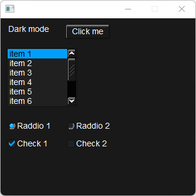

# Application_Enable_Dark_Mode

Shows how to create a simple [FLTK](https://www.fltk.org) application with dark mode.

## Source

[Application_Enable_Dark_Mode.cpp](Application_Enable_Dark_Mode.cpp)

[CMakeLists.txt](CMakeLists.txt)

## Output



## Generate and build

To build this project, open "Terminal" and type following lines:

### Windows :

``` shell
mkdir build && cd build
cmake .. 
start Application_Enable_Dark_Mode.sln
```

Select Application_Enable_Dark_Mode project and type Ctrl+F5 to build and run it.

### macOS :

``` shell
mkdir build && cd build
cmake .. -G "Xcode"
open ./Application_Enable_Dark_Mode.xcodeproj
```

Select Application_Enable_Dark_Mode project and type Cmd+R to build and run it.

### Linux :

``` shell
mkdir build && cd build
cmake .. 
cmake --build . --config Debug
./Application_Enable_Dark_Mode
```
