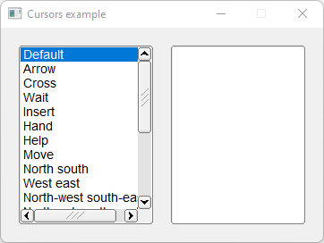

# Cursors

Shows how to change cursor of a widget with override handle method and use [fl_cursor](https://www.fltk.org/doc-1.3/group__fl__drawings.html#gac34f54a80fa846cf66f160bc02940bd2) method on FL_ENTER and FL_LEAVE events.

## Source

[Cursors.cpp](Cursors.cpp)

[Fl_Test_Cursor.h](Fl_Test_Cursor.h)

[CMakeLists.txt](CMakeLists.txt)

## Output



## Generate and build

To build this project, open "Terminal" and type following lines:

### Windows :

``` shell
mkdir build && cd build
cmake .. 
start Cursors.sln
```

Select Cursors project and type Ctrl+F5 to build and run it.

### macOS :

``` shell
mkdir build && cd build
cmake .. -G "Xcode"
open ./Cursors.xcodeproj
```

Select Cursors project and type Cmd+R to build and run it.

### Linux :

``` shell
mkdir build && cd build
cmake .. 
cmake --build . --config Debug
./Cursors
```
