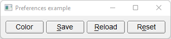

# Preferences

Shows how to use preferences with Fl_Preferences component.

## Source

[Preferences.cpp](Preferences.cpp)

[CMakeLists.txt](CMakeLists.txt)

## Output



## Generate and build

To build this project, open "Terminal" and type following lines:

### Windows :

``` shell
mkdir build && cd build
cmake .. 
start Preferences.sln
```

Select Preferences project and type Ctrl+F5 to build and run it.

### macOS :

``` shell
mkdir build && cd build
cmake .. -G "Xcode"
open ./Preferences.xcodeproj
```

Select Preferences project and type Cmd+R to build and run it.

### Linux :

``` shell
mkdir build && cd build
cmake .. 
cmake --build . --config Debug
./Preferences
```
