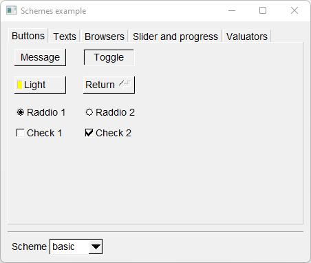

# Schemes

Shows how to use schemes with [Fl::scheme](https://www.fltk.org/doc-1.3/classFl.html#a9d070bb1d5a24c28beab53a70af095a4) methods.

## Source

[Schemes.cpp](Schemes.cpp)

[CMakeLists.txt](CMakeLists.txt)

## Output



## Generate and build

To build this project, open "Terminal" and type following lines:

### Windows :

``` shell
mkdir build && cd build
cmake .. 
start Schemes.sln
```

Select Schemes project and type Ctrl+F5 to build and run it.

### macOS :

``` shell
mkdir build && cd build
cmake .. -G "Xcode"
open ./Schemes.xcodeproj
```

Select Schemes project and type Cmd+R to build and run it.

### Linux :

``` shell
mkdir build && cd build
cmake .. 
cmake --build . --config Debug
./Schemes
```
