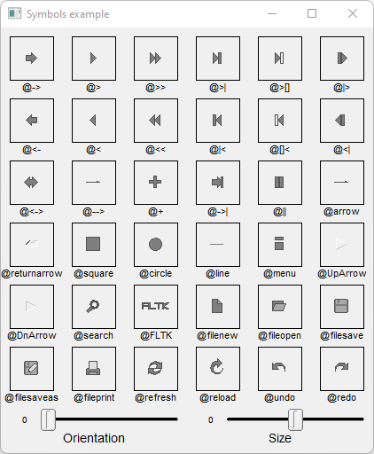

# Symbols

Shows how to use symbols with [Fl_Box](https://www.fltk.org/doc-1.3/classFl__Box.html) widget.

## Source

[Symbols.cpp](Symbols.cpp)

[CMakeLists.txt](CMakeLists.txt)

## Output



## Generate and build

To build this project, open "Terminal" and type following lines:

### Windows :

``` shell
mkdir build && cd build
cmake .. 
start Symbols.sln
```

Select Symbols project and type Ctrl+F5 to build and run it.

### macOS :

``` shell
mkdir build && cd build
cmake .. -G "Xcode"
open ./Symbols.xcodeproj
```

Select Symbols project and type Cmd+R to build and run it.

### Linux :

``` shell
mkdir build && cd build
cmake .. 
cmake --build . --config Debug
./Symbols
```
