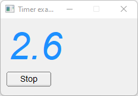

# Timer

Shows how to create a timer with [Fl::add_timeout](https://www.fltk.org/doc-1.3/classFl.html#a23e63eb7cec3a27fa360e66c6e2b2e52), [Fl::remove_timeout](https://www.fltk.org/doc-1.3/classFl.html#a9a950f0585de6416eb4fee2365a1578f) and Fl::repeat_timeout methods.

## Source

[Timer.cpp](Timer.cpp)

[CMakeLists.txt](CMakeLists.txt)

## Output



## Generate and build

To build this project, open "Terminal" and type following lines:

### Windows :

``` shell
mkdir build && cd build
cmake .. 
start Timer.sln
```

Select Timer project and type Ctrl+F5 to build and run it.

### macOS :

``` shell
mkdir build && cd build
cmake .. -G "Xcode"
open ./Timer.xcodeproj
```

Select Timer project and type Cmd+R to build and run it.

### Linux :

``` shell
mkdir build && cd build
cmake .. 
cmake --build . --config Debug
./Timer
```
