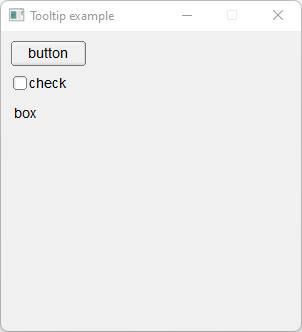

# Tooltip

Shows how to create a tooltip with Fl_Tooltip component.

## Source

[Tooltip.cpp](Tooltip.cpp)

[CMakeLists.txt](CMakeLists.txt)

## Output



## Generate and build

To build this project, open "Terminal" and type following lines:

### Windows :

``` shell
mkdir build && cd build
cmake .. 
start Tooltip.sln
```

Select Tooltip project and type Ctrl+F5 to build and run it.

### macOS :

``` shell
mkdir build && cd build
cmake .. -G "Xcode"
open ./Tooltip.xcodeproj
```

Select Tooltip project and type Cmd+R to build and run it.

### Linux :

``` shell
mkdir build && cd build
cmake .. 
cmake --build . --config Debug
./Tooltip
```
