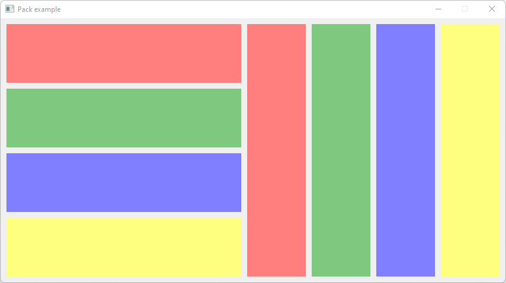

# Pack

Shows how to create a pack with [Fl_Pack](https://www.fltk.org/doc-1.3/classFl__Pack.html).

## Source

[Pack.cpp](Pack.cpp)

[CMakeLists.txt](CMakeLists.txt)

## Output



## Generate and build

To build this project, open "Terminal" and type following lines:

### Windows :

``` shell
mkdir build && cd build
cmake .. 
start Pack.sln
```

Select Pack project and type Ctrl+F5 to build and run it.

### macOS :

``` shell
mkdir build && cd build
cmake .. -G "Xcode"
open ./Pack.xcodeproj
```

Select Pack project and type Cmd+R to build and run it.

### Linux :

``` shell
mkdir build && cd build
cmake .. 
cmake --build . --config Debug
./Pack
```
