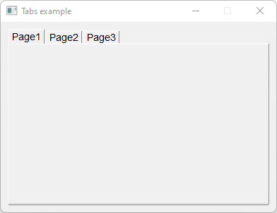

# Tabs

Shows how to create a tabs and pages with [Fl_Tabs](https://www.fltk.org/doc-1.3/classFl__Tabs.html) and [Fl_Group](https://www.fltk.org/doc-1.3/classFl__Group.html).

## Source

[Tabs.cpp](Tabs.cpp)

[CMakeLists.txt](CMakeLists.txt)

## Output



## Generate and build

To build this project, open "Terminal" and type following lines:

### Windows :

``` shell
mkdir build && cd build
cmake .. 
start Tabs.sln
```

Select Tabs project and type Ctrl+F5 to build and run it.

### macOS :

``` shell
mkdir build && cd build
cmake .. -G "Xcode"
open ./Tabs.xcodeproj
```

Select Tabs project and type Cmd+R to build and run it.

### Linux :

``` shell
mkdir build && cd build
cmake .. 
cmake --build . --config Debug
./Tabs
```
