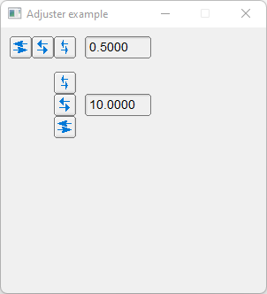

# Adjuster

Shows how to create adjusters with Fl_Adjuster valuator.

## Source

[Adjuster.cpp](Adjuster.cpp)

[CMakeLists.txt](CMakeLists.txt)

## Output



## Generate and build

To build this project, open "Terminal" and type following lines:

### Windows :

``` shell
mkdir build && cd build
cmake .. 
start Adjuster.sln
```

Select Adjuster project and type Ctrl+F5 to build and run it.

### macOS :

``` shell
mkdir build && cd build
cmake .. -G "Xcode"
open ./Adjuster.xcodeproj
```

Select Adjuster project and type Cmd+R to build and run it.

### Linux :

``` shell
mkdir build && cd build
cmake .. 
cmake --build . --config Debug
./Adjuster
```
