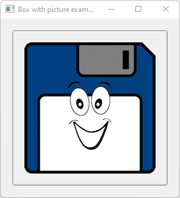

# Box_Picture

Shows how to use an image with [Fl_Box](https://www.fltk.org/doc-1.3/classFl__Box.html) widget.

## Source

[Box_Picture.cpp](Box_Picture.cpp)

[CMakeLists.txt](CMakeLists.txt)

[logo.xpm](logo.xpm)

## Output



## Generate and build

To build this project, open "Terminal" and type following lines:

### Windows :

``` shell
mkdir build && cd build
cmake .. 
start Box_Picture.sln
```

Select Box_Picture project and type Ctrl+F5 to build and run it.

### macOS :

``` shell
mkdir build && cd build
cmake .. -G "Xcode"
open ./Box_Picture.xcodeproj
```

Select Box_Picture project and type Cmd+R to build and run it.

### Linux :

``` shell
mkdir build && cd build
cmake .. 
cmake --build . --config Debug
./Box_Picture
```
