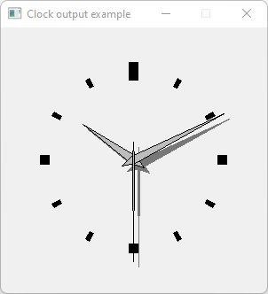

# Clock_Output

Shows how to create a static clock with Fl_Clock_Output widget.

## Source

[Clock_Output.cpp](Clock_Output.cpp)

[CMakeLists.txt](CMakeLists.txt)

## Output



## Generate and build

To build this project, open "Terminal" and type following lines:

### Windows :

``` shell
mkdir build && cd build
cmake .. 
start Clock_Output.sln
```

Select Clock_Output project and type Ctrl+F5 to build and run it.

### macOS :

``` shell
mkdir build && cd build
cmake .. -G "Xcode"
open ./Clock_Output.xcodeproj
```

Select Clock_Output project and type Cmd+R to build and run it.

### Linux :

``` shell
mkdir build && cd build
cmake .. 
cmake --build . --config Debug
./Clock_Output
```
