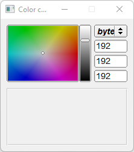

# Color_Chooser

Shows how to create a color chooser with [Fl_Color_Chooser](https://www.fltk.org/doc-1.3/classFl__Color__Chooser.html) widget.

## Source

[Color_Chooser.cpp](Color_Chooser.cpp)

[CMakeLists.txt](CMakeLists.txt)

## Output



## Generate and build

To build this project, open "Terminal" and type following lines:

### Windows :

``` shell
mkdir build && cd build
cmake .. 
start Color_Chooser.sln
```

Select Color_Chooser project and type Ctrl+F5 to build and run it.

### macOS :

``` shell
mkdir build && cd build
cmake .. -G "Xcode"
open ./Color_Chooser.xcodeproj
```

Select Color_Chooser project and type Cmd+R to build and run it.

### Linux :

``` shell
mkdir build && cd build
cmake .. 
cmake --build . --config Debug
./Color_Chooser
```
