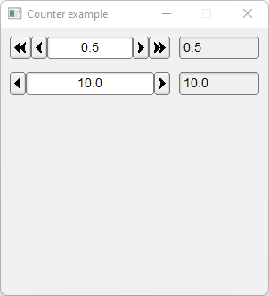

# Counter

Shows how to create counters with [Fl_Counter](https://www.fltk.org/doc-1.3/classFl__Counter.html) and [Fl_Simple_Counter](https://www.fltk.org/doc-1.3/classFl__Simple__Counter.html) valuators.

## Source

[Counter.cpp](Counter.cpp)

[CMakeLists.txt](CMakeLists.txt)

## Output



## Generate and build

To build this project, open "Terminal" and type following lines:

### Windows :

``` shell
mkdir build && cd build
cmake .. 
start Counter.sln
```

Select Counter project and type Ctrl+F5 to build and run it.

### macOS :

``` shell
mkdir build && cd build
cmake .. -G "Xcode"
open ./Counter.xcodeproj
```

Select Counter project and type Cmd+R to build and run it.

### Linux :

``` shell
mkdir build && cd build
cmake .. 
cmake --build . --config Debug
./Counter
```
