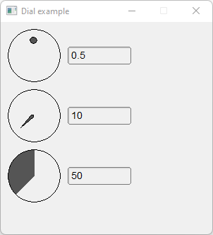

# Dial

Shows how to create dials with [Fl_Dial](https://www.fltk.org/doc-1.3/classFl__Dial.html), [Fl_Line_Dial](https://www.fltk.org/doc-1.3/classFl__Line__Dial.html) and [Fl_Fill_Dial](https://www.fltk.org/doc-1.3/classFl__Fill__Dial.html) valuators.

## Source

[Dial.cpp](Dial.cpp)

[CMakeLists.txt](CMakeLists.txt)

## Output



## Generate and build

To build this project, open "Terminal" and type following lines:

### Windows :

``` shell
mkdir build && cd build
cmake .. 
start Dial.sln
```

Select Dial project and type Ctrl+F5 to build and run it.

### macOS :

``` shell
mkdir build && cd build
cmake .. -G "Xcode"
open ./Dial.xcodeproj
```

Select Dial project and type Cmd+R to build and run it.

### Linux :

``` shell
mkdir build && cd build
cmake .. 
cmake --build . --config Debug
./Dial
```
