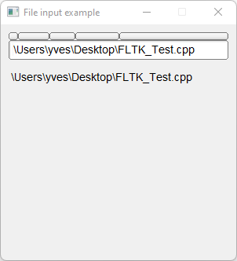

# File_Input

Shows how to create a file input with [Fl_File_Input](https://www.fltk.org/doc-1.3/classFl__File__Input.html) widget.

## Source

[File_Input.cpp](File_Input.cpp)

[CMakeLists.txt](CMakeLists.txt)

## Output



## Generate and build

To build this project, open "Terminal" and type following lines:

### Windows :

``` shell
mkdir build && cd build
cmake .. 
start File_Input.sln
```

Select File_Input project and type Ctrl+F5 to build and run it.

### macOS :

``` shell
mkdir build && cd build
cmake .. -G "Xcode"
open ./File_Input.xcodeproj
```

Select File_Input project and type Cmd+R to build and run it.

### Linux :

``` shell
mkdir build && cd build
cmake .. 
cmake --build . --config Debug
./File_Input
```
