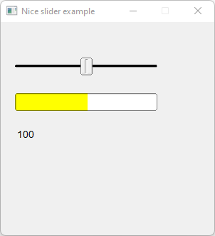

# Nice_Slider

Shows how to create a slider with [Fl_Nice_Slider](https://www.fltk.org/doc-1.3/classFl__Nice__Slider.html) widget.

## Source

[Nice_Slider.cpp](Nice_Slider.cpp)

[CMakeLists.txt](CMakeLists.txt)

## Output



## Generate and build

To build this project, open "Terminal" and type following lines:

### Windows :

``` shell
mkdir build && cd build
cmake .. 
start Nice_Slider.sln
```

Select Nice_Slider project and type Ctrl+F5 to build and run it.

### macOS :

``` shell
mkdir build && cd build
cmake .. -G "Xcode"
open ./Nice_Slider.xcodeproj
```

Select Nice_Slider project and type Cmd+R to build and run it.

### Linux :

``` shell
mkdir build && cd build
cmake .. 
cmake --build . --config Debug
./Nice_Slider
```
