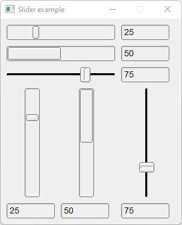

# Slider

Shows how to create sliders with [Fl_Hor_Slider](https://www.fltk.org/doc-1.3/classFl__Hor__Slider.html), Fl_Hor_Fill_Slider, Fl_Hor_Nice_Slider, Fl_Slider, Fl_Fill_Slider and [Fl_Nice_Slider](https://www.fltk.org/doc-1.3/classFl__Nice__Slider.html) valuators.

## Source

[Slider.cpp](Slider.cpp)

[CMakeLists.txt](CMakeLists.txt)

## Output



## Generate and build

To build this project, open "Terminal" and type following lines:

### Windows :

``` shell
mkdir build && cd build
cmake .. 
start Slider.sln
```

Select Slider project and type Ctrl+F5 to build and run it.

### macOS :

``` shell
mkdir build && cd build
cmake .. -G "Xcode"
open ./Slider.xcodeproj
```

Select Slider project and type Cmd+R to build and run it.

### Linux :

``` shell
mkdir build && cd build
cmake .. 
cmake --build . --config Debug
./Slider
```
