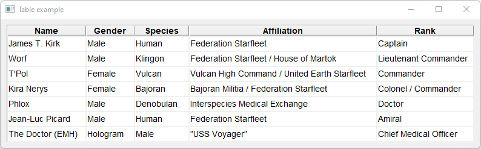

# Table

Shows how to usea table with [Fl_Table](https://www.fltk.org/doc-1.3/classFl__Table.html) widget.

## Source

[Table.cpp](Table.cpp)

[CMakeLists.txt](CMakeLists.txt)

## Output



## Generate and build

To build this project, open "Terminal" and type following lines:

### Windows :

``` shell
mkdir build && cd build
cmake .. 
start Table.sln
```

Select Table project and type Ctrl+F5 to build and run it.

### macOS :

``` shell
mkdir build && cd build
cmake .. -G "Xcode"
open ./Table.xcodeproj
```

Select Table project and type Cmd+R to build and run it.

### Linux :

``` shell
mkdir build && cd build
cmake .. 
cmake --build . --config Debug
./Table
```
