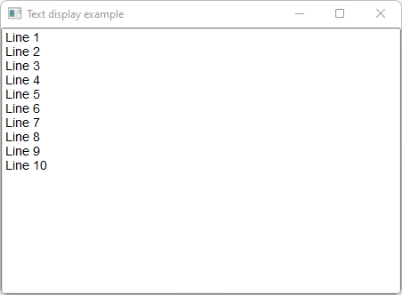

# Text_Display

Shows how to use a text display with Fl_Text_Display widget.

## Source

[Text_Display.cpp](Text_Display.cpp)

[CMakeLists.txt](CMakeLists.txt)

## Output



## Generate and build

To build this project, open "Terminal" and type following lines:

### Windows :

``` shell
mkdir build && cd build
cmake .. 
start Text_Display.sln
```

Select Text_Display project and type Ctrl+F5 to build and run it.

### macOS :

``` shell
mkdir build && cd build
cmake .. -G "Xcode"
open ./Text_Display.xcodeproj
```

Select Text_Display project and type Cmd+R to build and run it.

### Linux :

``` shell
mkdir build && cd build
cmake .. 
cmake --build . --config Debug
./Text_Display
```
