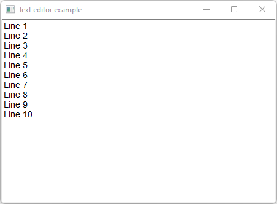

# Text_Editor

Shows how to use a text editor with Fl_Text_Editor widget.

## Source

[Text_Editor.cpp](Text_Editor.cpp)

[CMakeLists.txt](CMakeLists.txt)

## Output



## Generate and build

To build this project, open "Terminal" and type following lines:

### Windows :

``` shell
mkdir build && cd build
cmake .. 
start Text_Editor.sln
```

Select Text_Editor project and type Ctrl+F5 to build and run it.

### macOS :

``` shell
mkdir build && cd build
cmake .. -G "Xcode"
open ./Text_Editor.xcodeproj
```

Select Text_Editor project and type Cmd+R to build and run it.

### Linux :

``` shell
mkdir build && cd build
cmake .. 
cmake --build . --config Debug
./Text_Editor
```
