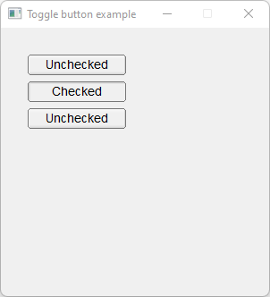

# Toggle_Button

Shows how to create a toggle button with [Fl_Toggle_Button](https://www.fltk.org/doc-1.3/classFl__Toggle__Button.html) widget.

## Source

[Toggle_Button.cpp](Toggle_Button.cpp)

[CMakeLists.txt](CMakeLists.txt)

## Output



## Generate and build

To build this project, open "Terminal" and type following lines:

### Windows :

``` shell
mkdir build && cd build
cmake .. 
start Toggle_Button.sln
```

Select Toggle_Button project and type Ctrl+F5 to build and run it.

### macOS :

``` shell
mkdir build && cd build
cmake .. -G "Xcode"
open ./Toggle_Button.xcodeproj
```

Select Box project and type Cmd+R to build and run it.

### Linux :

``` shell
mkdir build && cd build
cmake .. 
cmake --build . --config Debug
./Toggle_Button
```
