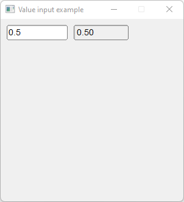

# Value_Input

Shows how to create a value input with Fl_Adjuster valuator.

## Source

[Value_Input.cpp](Value_Input.cpp)

[CMakeLists.txt](CMakeLists.txt)

## Output



## Generate and build

To build this project, open "Terminal" and type following lines:

### Windows :

``` shell
mkdir build && cd build
cmake .. 
start Value_Input.sln
```

Select Value_Input project and type Ctrl+F5 to build and run it.

### macOS :

``` shell
mkdir build && cd build
cmake .. -G "Xcode"
open ./Value_Input.xcodeproj
```

Select Value_Input project and type Cmd+R to build and run it.

### Linux :

``` shell
mkdir build && cd build
cmake .. 
cmake --build . --config Debug
./Value_Input
```
