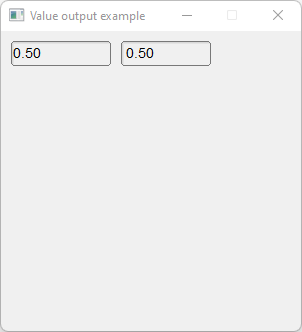

# Value_Output

Shows how to create a value output with [Fl_Value_Output](https://www.fltk.org/doc-1.3/classFl__Value__Output.html) valuator.

## Source

[Value_Output.cpp](Value_Output.cpp)

[CMakeLists.txt](CMakeLists.txt)

## Output



## Generate and build

To build this project, open "Terminal" and type following lines:

### Windows :

``` shell
mkdir build && cd build
cmake .. 
start Value_Output.sln
```

Select Value_Output project and type Ctrl+F5 to build and run it.

### macOS :

``` shell
mkdir build && cd build
cmake .. -G "Xcode"
open ./Value_Output.xcodeproj
```

Select Value_Output project and type Cmd+R to build and run it.

### Linux :

``` shell
mkdir build && cd build
cmake .. 
cmake --build . --config Debug
./Value_Output
```
