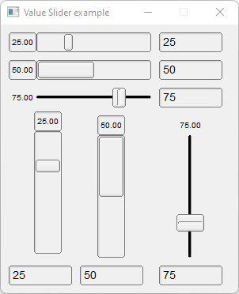

# Value_Slider

Shows how to create value sliders with [Fl_Hor_Value_Slider](https://www.fltk.org/doc-1.3/classFl__Hor__Value__Slider.html) and Fl_Value_Slider valuators.

## Source

[Value_Slider.cpp](Value_Slider.cpp)

[CMakeLists.txt](CMakeLists.txt)

## Output



## Generate and build

To build this project, open "Terminal" and type following lines:

### Windows :

``` shell
mkdir build && cd build
cmake .. 
start Value_Slider.sln
```

Select Value_Slider project and type Ctrl+F5 to build and run it.

### macOS :

``` shell
mkdir build && cd build
cmake .. -G "Xcode"
open ./Value_Slider.xcodeproj
```

Select Value_Slider project and type Cmd+R to build and run it.

### Linux :

``` shell
mkdir build && cd build
cmake .. 
cmake --build . --config Debug
./Value_Slider
```
