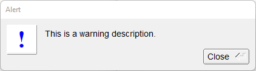

# Alert

Shows how to use alert box with [fl_alert](https://www.fltk.org/doc-1.3/group__group__comdlg.html#gae998e9cd38954bfde24bd20e550e9b8a) method.

## Source

[Alert.cpp](Alert.cpp)

[CMakeLists.txt](CMakeLists.txt)

## Output



## Generate and build

To build this project, open "Terminal" and type following lines:

### Windows :

``` shell
mkdir build && cd build
cmake .. 
start Alert.sln
```

Select Alert project and type Ctrl+F5 to build and run it.

### macOS :

``` shell
mkdir build && cd build
cmake .. -G "Xcode"
open ./Alert.xcodeproj
```

Select Alert project and type Cmd+R to build and run it.

### Linux :

``` shell
mkdir build && cd build
cmake .. 
cmake --build . --config Debug
./Alert
```
