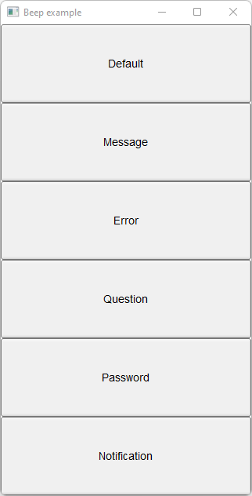

# Beep

Shows how to use a beep with [fl_beep](https://www.fltk.org/doc-1.3/group__group__comdlg.html#ga7df367b297d2b2d1af087e1adbf3c265) method.

## Source

[Beep.cpp](Beep.cpp)

[CMakeLists.txt](CMakeLists.txt)

## Output



## Generate and build

To build this project, open "Terminal" and type following lines:

### Windows :

``` shell
mkdir build && cd build
cmake .. 
start Beep.sln
```

Select Beep project and type Ctrl+F5 to build and run it.

### macOS :

``` shell
mkdir build && cd build
cmake .. -G "Xcode"
open ./Beep.xcodeproj
```

Select Beep project and type Cmd+R to build and run it.

### Linux :

``` shell
mkdir build && cd build
cmake .. 
cmake --build . --config Debug
./Beep
```
