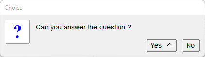

# Choice

Shows how to use choice box with [fl_choice](https://www.fltk.org/doc-1.3/group__group__comdlg.html#ga36c19b29fcd5c261f3eafdf9f7126b16) method.

## Source

[Choice.cpp](Choice.cpp)

[CMakeLists.txt](CMakeLists.txt)

## Output



## Generate and build

To build this project, open "Terminal" and type following lines:

### Windows :

``` shell
mkdir build && cd build
cmake .. 
start Choice.sln
```

Select Choice project and type Ctrl+F5 to build and run it.

### macOS :

``` shell
mkdir build && cd build
cmake .. -G "Xcode"
open ./Choice.xcodeproj
```

Select Choice project and type Cmd+R to build and run it.

### Linux :

``` shell
mkdir build && cd build
cmake .. 
cmake --build . --config Debug
./Choice
```
