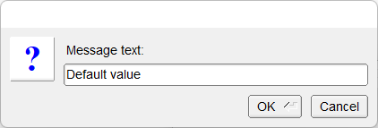

# Input_Dialog

Shows how to use input box with fl_input method.

## Source

[Input_Dialog.cpp](Input_Dialog.cpp)

[CMakeLists.txt](CMakeLists.txt)

## Output



## Generate and build

To build this project, open "Terminal" and type following lines:

### Windows :

``` shell
mkdir build && cd build
cmake .. 
start Input_Dialog.sln
```

Select Input_Dialog project and type Ctrl+F5 to build and run it.

### macOS :

``` shell
mkdir build && cd build
cmake .. -G "Xcode"
open ./Input_Dialog.xcodeproj
```

Select Input_Dialog project and type Cmd+R to build and run it.

### Linux :

``` shell
mkdir build && cd build
cmake .. 
cmake --build . --config Debug
./Input_Dialog
```
