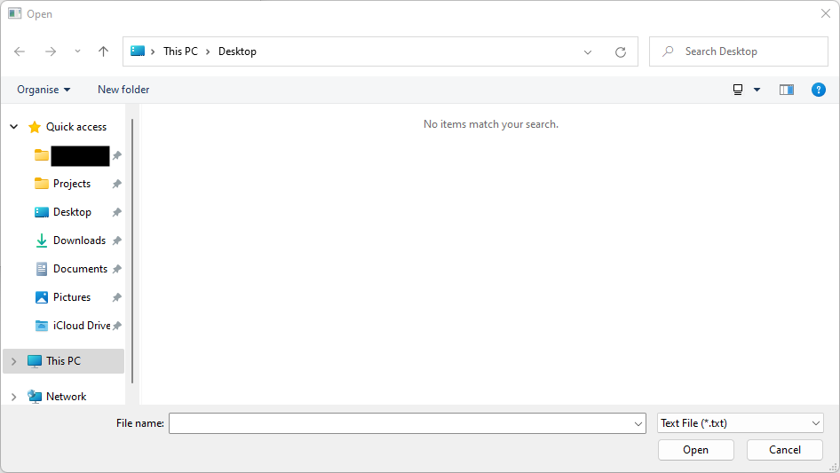

# Native_File_Chooser_Browse_File

Shows how to use a native file chooser dialog to browse file with [Fl_Native_File_Chooser](https://www.fltk.org/doc-1.3/classFl__Native__File__Chooser.html) dialog.

## Source

[Native_File_Chooser_Browse_File.cpp](Native_File_Chooser_Browse_File.cpp)

[CMakeLists.txt](CMakeLists.txt)

## Output



## Generate and build

To build this project, open "Terminal" and type following lines:

### Windows :

``` shell
mkdir build && cd build
cmake .. 
start Native_File_Chooser_Browse_File.sln
```

Select Native_File_Chooser_Browse_File project and type Ctrl+F5 to build and run it.

### macOS :

``` shell
mkdir build && cd build
cmake .. -G "Xcode"
open ./Native_File_Chooser_Browse_File.xcodeproj
```

Select Native_File_Chooser_Browse_File project and type Cmd+R to build and run it.

### Linux :

``` shell
mkdir build && cd build
cmake .. 
cmake --build . --config Debug
./Native_File_Chooser_Browse_File
```
