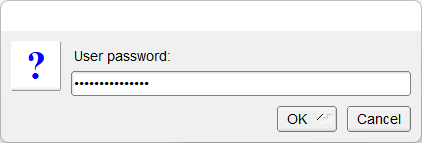

# Password

Shows how to use password box with [fl_password](https://www.fltk.org/doc-1.3/group__group__comdlg.html#ga46a734743667b14b086f72b3e5c3a858) method.

## Source

[Password.cpp](Password.cpp)

[CMakeLists.txt](CMakeLists.txt)

## Output



## Generate and build

To build this project, open "Terminal" and type following lines:

### Windows :

``` shell
mkdir build && cd build
cmake .. 
start Password.sln
```

Select Password project and type Ctrl+F5 to build and run it.

### macOS :

``` shell
mkdir build && cd build
cmake .. -G "Xcode"
open ./Password.xcodeproj
```

Select Password project and type Cmd+R to build and run it.

### Linux :

``` shell
mkdir build && cd build
cmake .. 
cmake --build . --config Debug
./Password
```
