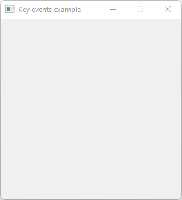

# Key_Events

Demonstrates the use of [keyboard events](https://www.fltk.org/doc-1.3/events.html#events_keyboard).

## Source

[Key_Events.cpp](Key_Events.cpp)

[Fl_Trace_Window.h](Fl_Trace_Window.h)

[CMakeLists.txt](CMakeLists.txt)

## Output



## Generate and build

To build this project, open "Terminal" and type following lines:

### Windows :

``` shell
mkdir build && cd build
cmake .. 
start Key_Events.sln
```

Select Key_Events project and type Ctrl+F5 to build and run it.

### macOS :

``` shell
mkdir build && cd build
cmake .. -G "Xcode"
open ./Key_Events.xcodeproj
```

Select Key_Events project and type Cmd+R to build and run it.

### Linux :

``` shell
mkdir build && cd build
cmake .. 
cmake --build . --config Debug
./Key_Events
```
