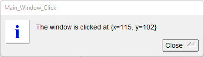

# Window_Click

Shows how to use [mouse click event](https://www.fltk.org/doc-1.3/events.html#events_mouse) with override handle method and use [Fl::event_button](https://www.fltk.org/doc-1.3/group__fl__events.html#ga7ae6d99ceb1a2afb8a1dc4455ac941cd), [Fl::event_x](https://www.fltk.org/doc-1.3/group__fl__events.html#ga91585fcbaa1e79f7452fd2d16a82136e) and [Fl::event_y](https://www.fltk.org/doc-1.3/group__fl__events.html#ga192a0c5a37f33b9d117a69f20977c2a1) methods on [FL_RELEASE](https://www.fltk.org/doc-1.3/events.html#events_fl_release) event.

## Source

[Window_Click.cpp](Window_Click.cpp)

[CMakeLists.txt](CMakeLists.txt)

## Output



## Generate and build

To build this project, open "Terminal" and type following lines:

### Windows :

``` shell
mkdir build && cd build
cmake .. 
start Window_Click.sln
```

Select Window_Click project and type Ctrl+F5 to build and run it.

### macOS :

``` shell
mkdir build && cd build
cmake .. -G "Xcode"
open ./Window_Click.xcodeproj
```

Select Window_Click project and type Cmd+R to build and run it.

### Linux :

``` shell
mkdir build && cd build
cmake .. 
cmake --build . --config Debug
./Window_Click
```
