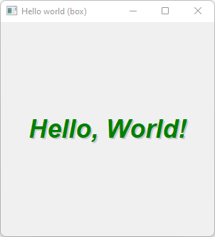

# Hello_World_Box

The classic first application "Hello World" with [Fl_Box](https://www.fltk.org/doc-1.3/classFl__Box.html).

## Source

[Hello_World_Box.cpp](Hello_World_Box.cpp)

[CMakeLists.txt](CMakeLists.txt)

## Output



## Generate and build

To build this project, open "Terminal" and type following lines:

### Windows :

``` shell
mkdir build && cd build
cmake .. 
start Hello_World_Box.sln
```

Select Hello_World_Box project and type Ctrl+F5 to build and run it.

### macOS :

``` shell
mkdir build && cd build
cmake .. -G "Xcode"
open ./Hello_World_Box.xcodeproj
```

Select Hello_World_Box project and type Cmd+R to build and run it.

### Linux :

``` shell
mkdir build && cd build
cmake .. 
cmake --build . --config Debug
./Hello_World_Box
```
