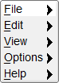

# Menu_Button

Shows how to create a menu button with Fl_Menu_Button widget.

## Source

[Menu_Button.cpp](Menu_Button.cpp)

[CMakeLists.txt](CMakeLists.txt)

## Output



## Generate and build

To build this project, open "Terminal" and type following lines:

### Windows :

``` shell
mkdir build && cd build
cmake .. 
start Menu_Button.sln
```

Select Menu_Button project and type Ctrl+F5 to build and run it.

### macOS :

``` shell
mkdir build && cd build
cmake .. -G "Xcode"
open ./Menu_Button.xcodeproj
```

Select Menu_Button project and type Cmd+R to build and run it.

### Linux :

``` shell
mkdir build && cd build
cmake .. 
cmake --build . --config Debug
./Menu_Button
```
