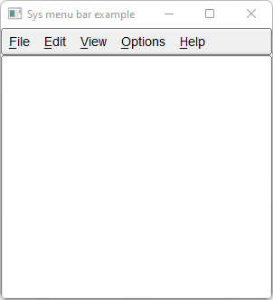

# Sys_Menu_Bar

Shows how to create a system menu bar with Fl_Sys_Menu_Bar widget.

## Source

[Sys_Menu_Bar.cpp](Sys_Menu_Bar.cpp)

[CMakeLists.txt](CMakeLists.txt)

## Output



## Generate and build

To build this project, open "Terminal" and type following lines:

### Windows :

``` shell
mkdir build && cd build
cmake .. 
start Sys_Menu_Bar.sln
```

Select Sys_Menu_Bar project and type Ctrl+F5 to build and run it.

### macOS :

``` shell
mkdir build && cd build
cmake .. -G "Xcode"
open ./Sys_Menu_Bar.xcodeproj
```

Select Sys_Menu_Bar project and type Cmd+R to build and run it.

### Linux :

``` shell
mkdir build && cd build
cmake .. 
cmake --build . --config Debug
./Sys_Menu_Bar
```
