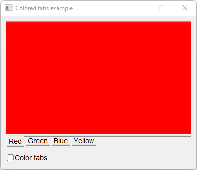

# Colored_Tabs

Shows how to create a tabs and colored pages with Fl_Tabs and Fl_Group..

## Source

[Colored_Tabs.cpp](Colored_Tabs.cpp)

[CMakeLists.txt](CMakeLists.txt)

## Output



## Generate and build

To build this project, open "Terminal" and type following lines:

### Windows :

``` shell
mkdir build && cd build
cmake .. 
start Colored_Tabs.sln
```

Select Colored_Tabs project and type Ctrl+F5 to build and run it.

### macOS :

``` shell
mkdir build && cd build
cmake .. -G "Xcode"
open ./Colored_Tabs.xcodeproj
```

Select Colored_Tabs project and type Cmd+R to build and run it.

### Linux :

``` shell
mkdir build && cd build
cmake .. 
cmake --build . --config Debug
./Colored_Tabs
```
