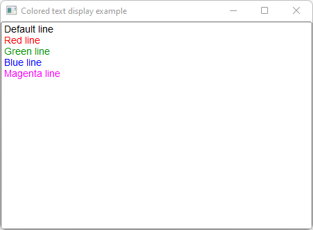

# Colored_Text_Display

Shows how to create a colored text display with [Fl_Text_Display](https://www.fltk.org/doc-1.3/classFl__Text__Display.html).

## Source

[Colored_Text_Display.cpp](Colored_Text_Display.cpp)

[CMakeLists.txt](CMakeLists.txt)

## Output



## Generate and build

To build this project, open "Terminal" and type following lines:

### Windows :

``` shell
mkdir build && cd build
cmake .. 
start Colored_Text_Display.sln
```

Select Colored_Text_Display project and type Ctrl+F5 to build and run it.

### macOS :

``` shell
mkdir build && cd build
cmake .. -G "Xcode"
open ./Colored_Text_Display.xcodeproj
```

Select Colored_Text_Display project and type Cmd+R to build and run it.

### Linux :

``` shell
mkdir build && cd build
cmake .. 
cmake --build . --config Debug
./Colored_Text_Display
```
