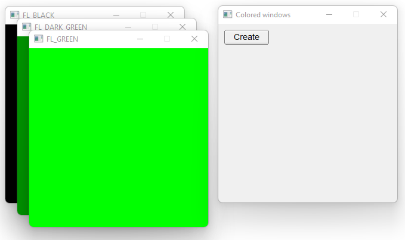

# Colored_Windows

Shows how to create a colored windows with [Fl_Window](https://www.fltk.org/doc-1.3/classFl__Window.html).

## Source
  
[Colored_Windows.cpp](Colored_Windows.cpp)

[CMakeLists.txt](CMakeLists.txt)

## Output



## Generate and build

To build this project, open "Terminal" and type following lines:

### Windows :

``` shell
mkdir build && cd build
cmake .. 
start Colored_Windows.sln
```

Select Colored_Windows project and type Ctrl+F5 to build and run it.

### macOS :

``` shell
mkdir build && cd build
cmake .. -G "Xcode"
open ./Colored_Windows.xcodeproj
```

Select Colored_Windows project and type Cmd+R to build and run it.

### Linux :

``` shell
mkdir build && cd build
cmake .. 
cmake --build . --config Debug
./Colored_Windows
```
