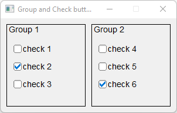

# Group_And_Check_Button

Shows how to use group and check buttons with [Fl_Group](https://www.fltk.org/doc-1.3/classFl__Group.html) and Fl_Check_Button widgets.

## Source

[Group_And_Check_Button.cpp](Group_And_Check_Button.cpp)

[CMakeLists.txt](CMakeLists.txt)

## Output



## Generate and build

To build this project, open "Terminal" and type following lines:

### Windows :

``` shell
mkdir build && cd build
cmake .. 
start Group_And_Check_Button.sln
```

Select Group_And_Check_Button project and type Ctrl+F5 to build and run it.

### macOS :

``` shell
mkdir build && cd build
cmake .. -G "Xcode"
open ./Group_And_Check_Button.xcodeproj
```

Select Group_And_Check_Button project and type Cmd+R to build and run it.

### Linux :

``` shell
mkdir build && cd build
cmake .. 
cmake --build . --config Debug
./Group_And_Check_Button
```
