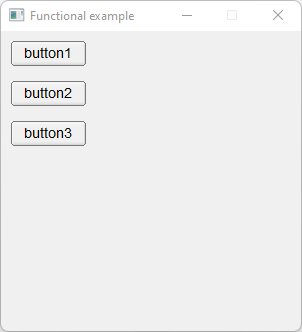

# Functional

Shows how to use callback method with std::function, std::bind and lambda methods.

## Source

[Functional.cpp](Functional.cpp)

[fl_functional.h](fl_functional.h)

[CMakeLists.txt](CMakeLists.txt)

## Output



## Generate and build

To build this project, open "Terminal" and type following lines:

### Windows :

``` shell
mkdir build && cd build
cmake .. 
start Functional.sln
```

Select Functional project and type Ctrl+F5 to build and run it.

### macOS :

``` shell
mkdir build && cd build
cmake .. -G "Xcode"
open ./Functional.xcodeproj
```

Select Functional project and type Cmd+R to build and run it.

### Linux :

``` shell
mkdir build && cd build
cmake .. 
cmake --build . --config Debug
./Functional
```
