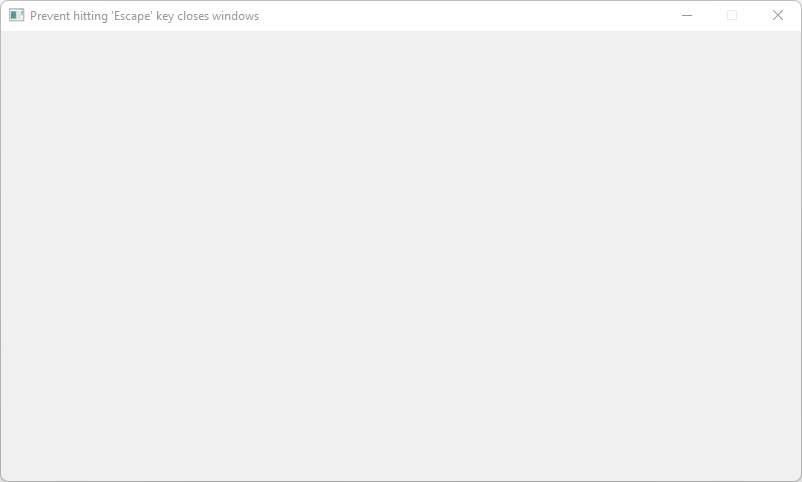

# Prevent_Hitting_Escape_Key_Closes_Windows

Shows how to prevent hitting 'Escape' key ([FL_Escape](https://www.fltk.org/doc-1.3/Enumerations_8H.html#a91b983ebe4cd86393e2addb8ab40a326)) closes Windows with [Fl::add_handler](https://www.fltk.org/doc-1.3/group__fl__events.html#gae2d39bda7362e444afa41166c478b904) method.

## Source

[Prevent_Hitting_Escape_Key_Closes_Windows.cpp](Prevent_Hitting_Escape_Key_Closes_Windows.cpp)

[CMakeLists.txt](CMakeLists.txt)

## Output



## Generate and build

To build this project, open "Terminal" and type following lines:

### Windows :

``` shell
mkdir build && cd build
cmake .. 
start Prevent_Hitting_Escape_Key_Closes_Windows.sln
```

Select Prevent_Hitting_Escape_Key_Closes_Windows project and type Ctrl+F5 to build and run it.

### macOS :

``` shell
mkdir build && cd build
cmake .. -G "Xcode"
open ./Prevent_Hitting_Escape_Key_Closes_Windows.xcodeproj
```

Select Prevent_Hitting_Escape_Key_Closes_Windows project and type Cmd+R to build and run it.

### Linux :

``` shell
mkdir build && cd build
cmake .. 
cmake --build . --config Debug
./Prevent_Hitting_Escape_Key_Closes_Windows
```
