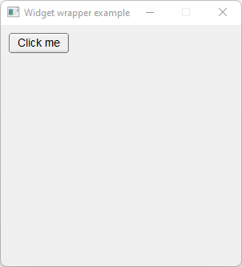

# Widget_Wrapper

Shows how to use callback method with [std::function](https://en.cppreference.com/w/cpp/utility/functional/function), [std::bind](https://en.cppreference.com/w/cpp/utility/functional/bind) and [lambda](https://en.cppreference.com/w/cpp/language/lambda) methods.

## Source

[Widget_Wrapper.cpp](Widget_Wrapper.cpp)

[Fl_Widget_Wrapper.h](Fl_Widget_Wrapper.h)

[CMakeLists.txt](CMakeLists.txt)

## Output



## Generate and build

To build this project, open "Terminal" and type following lines:

### Windows :

``` shell
mkdir build && cd build
cmake .. 
start Widget_Wrapper.sln
```

Select Widget_Wrapper project and type Ctrl+F5 to build and run it.

### macOS :

``` shell
mkdir build && cd build
cmake .. -G "Xcode"
open ./Widget_Wrapper.xcodeproj
```

Select Widget_Wrapper project and type Cmd+R to build and run it.

### Linux :

``` shell
mkdir build && cd build
cmake .. 
cmake --build . --config Debug
./Widget_Wrapper
```
