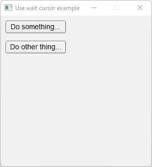

# Use_Wait_Cursor

Shows how to use own Fl_Use_Wait_cursor component or own fl_use_wait_cursor method.

## Source

[Use_Wait_Cursor.cpp](Use_Wait_Cursor.cpp)

[Fl_Use_Wait_Cursor.h](Fl_Use_Wait_Cursor.h)

[Fl_Use_Wait_Cursor.cpp](Fl_Use_Wait_Cursor.cpp)

[CMakeLists.txt](CMakeLists.txt)

## Output



## Generate and build

To build this project, open "Terminal" and type following lines:

### Windows :

``` shell
mkdir build && cd build
cmake .. 
start Use_Wait_Cursor.sln
```

Select Use_Wait_Cursor project and type Ctrl+F5 to build and run it.

### macOS :

``` shell
mkdir build && cd build
cmake .. -G "Xcode"
open ./Use_Wait_Cursor.xcodeproj
```

Select Use_Wait_Cursor project and type Cmd+R to build and run it.

### Linux :

``` shell
mkdir build && cd build
cmake .. 
cmake --build . --config Debug
./Use_Wait_Cursor
```
