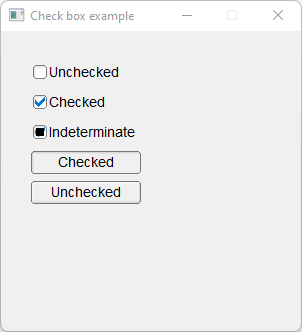

# Check_Box

Shows how to create a check box with own [Fl_Check_Box](Fl_Check_Box.h) widget.

## Source

[Check_Box.cpp](Check_Box.cpp)

[Fl_Check_Box.h](Fl_Check_Box.h)

[CMakeLists.txt](CMakeLists.txt)

## Output



## Generate and build

To build this project, open "Terminal" and type following lines:

### Windows :

``` shell
mkdir build && cd build
cmake .. 
start Check_Box.sln
```

Select Check_Box project and type Ctrl+F5 to build and run it.

### macOS :

``` shell
mkdir build && cd build
cmake .. -G "Xcode"
open ./Check_Box.xcodeproj
```

Select Check_Box project and type Cmd+R to build and run it.

### Linux :

``` shell
mkdir build && cd build
cmake .. 
cmake --build . --config Debug
./Check_Box
```
