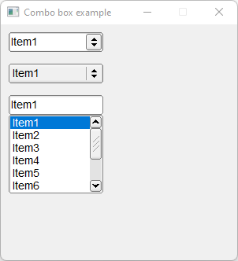

# Combo_Box

Shows how to create Combo boxes with own Fl_Combo_Box widgets.

## Source

[Combo_Box.cpp](Combo_Box.cpp)

[Fl_Combo_Box_Style.h](Fl_Combo_Box_Style.h)

[Fl_Combo_Box.h](Fl_Combo_Box.h)

[CMakeLists.txt](CMakeLists.txt)

## Output



## Generate and build

To build this project, open "Terminal" and type following lines:

### Windows :

``` shell
mkdir build && cd build
cmake .. 
start Combo_Box.sln
```

Select Combo_Box project and type Ctrl+F5 to build and run it.

### macOS :

``` shell
mkdir build && cd build
cmake .. -G "Xcode"
open ./Combo_Box.xcodeproj
```

Select Combo_Box project and type Cmd+R to build and run it.

### Linux :

``` shell
mkdir build && cd build
cmake .. 
cmake --build . --config Debug
./Combo_Box
```
