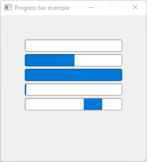

# Progress_Bar

Shows how to create a progress bar with own [Fl_Progress_Bar](Fl_Progress_Bar.h) widget.

## Source

[Progress_Bar.cpp](Progress_Bar.cpp)

[Fl_Progress_Bar.h](Fl_Progress_Bar.h)

[CMakeLists.txt](CMakeLists.txt)

## Output



## Generate and build

To build this project, open "Terminal" and type following lines:

### Windows :

``` shell
mkdir build && cd build
cmake .. 
start Progress_Bar.sln
```

Select Progress_Bar project and type Ctrl+F5 to build and run it.

### macOS :

``` shell
mkdir build && cd build
cmake .. -G "Xcode"
open ./Progress_Bar.xcodeproj
```

Select Progress_Bar project and type Cmd+R to build and run it.

### Linux :

``` shell
mkdir build && cd build
cmake .. 
cmake --build . --config Debug
./Progress_Bar
```
