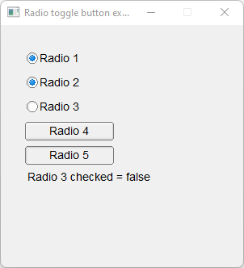

# Radio_Toggle_Button

Shows how to create a radio button with own Fl_Radio_Toggle_Button widget.

## Source

[Radio_Toggle_Button.cpp](Radio_Toggle_Button.cpp)

[Fl_Radio_Toggle_Button.h](Fl_Radio_Toggle_Button.h)

[CMakeLists.txt](CMakeLists.txt)

## Output



## Generate and build

To build this project, open "Terminal" and type following lines:

### Windows :

``` shell
mkdir build && cd build
cmake .. 
start Radio_Toggle_Button.sln
```

Select Radio_Toggle_Button project and type Ctrl+F5 to build and run it.

### macOS :

``` shell
mkdir build && cd build
cmake .. -G "Xcode"
open ./Radio_Toggle_Button.xcodeproj
```

Select Radio_Toggle_Button project and type Cmd+R to build and run it.

### Linux :

``` shell
mkdir build && cd build
cmake .. 
cmake --build . --config Debug
./Radio_Toggle_Button
```
